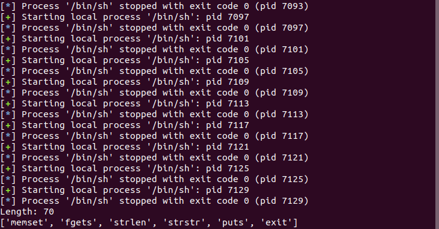

## Laboratory 01

**Prerequisites:**

```bash
sudo apt-get install strace ltrace
```

**Laboratory:**

- Started by using `ltrace` over the `obscure` binary.
  
  ```bash
  ltrace ./obscure
  ```

- From which we learn the expected input:
   

### Task 1: for Linux

**Prerequisites:**

- Install pwntools: 
  
  ```bash
  sudo apt-get update
  sudo apt-get install python3 python3-pip python3-dev git libssl-dev libffi-dev build-essential
  python3 -m pip install --upgrade pip
  python3 -m pip install --upgrade pwntools
  ```

**P1:** After running the code in `p1.py`, we can see the following output in the console:


**P2:** We wrap the process run inside the `ltrace` to get all the library functions that are called, thus the output after running the code in `p2.py`. We notice a call for `strlen` which gives us the clue that the program is checking for input's length. 


**P3:** By running the code in `p3.py`, we discover that the minimum length for the input string is `70`. 


By calling `p2.py`, but with a string of `70` characters, we obtain a **first substring** which we add to the payload that we'll use further.


**P4:** We start constructing the payload by using the first substring found at `P3`. The code should look like this: 

```python
from pwn import * # sudo pip install pwntools


# start process interaction
# use "process" from pwntools
# wrap the process run inside "ltrace"
p = process("ltrace ./crackme", shell=True)

# send input
# use "send"/"sendline" from pwntools
# construct the payload based on findings.
payload = "zihldazjcn"

# add other payloads depending on the findings and adapt the "i"
# placeholder length on the way

# payload += "example_payload"
payload += 'i' * 50
p.sendline(payload)

# keep reading output until program terminates
while True:
    try:
        #use "readline" from pwntools
        line = p.readline()
        print ("Read line: [%s]" % line)

        #TODO
    except:
        #could not read line => program exited
        break
```

After passing all the checks (obtaining all the substrings), we build our payload by combining all the found strings. We call the application once again by:

```bash
./crackme
```

and feed it our paylod which results the following output:


**P5:** Using the code in `p5.py`, we are able to obtain all the possible combinations of the previously obtained substrings. Being too large, we need to filter it by tossing away any verbosity and making the results less noisy. This is done with the solution written in `p5_result.py`. Reading over the `filtered_output.txt`, we find our flag at a specific candidate. 


Using that candidate as payload to our `./crackme`, we can verify it works.


---

### Task 2: for Windows 

**Prerequisites:**
- Install [Process Monitor](https://learn.microsoft.com/en-us/sysinternals/downloads/procmon#download)
- Install [API Monitor](http://www.rohitab.com/apimonitor)
- Disable Virus & Threat Protection from Windows Security.
- Add `malware.exe` to Exceptions to be able to freely investigate its behavior without Windows Defender removing it.

**P1:** Start **API Monitor x86** (because executable is 32-bit) and start `Monitor New Process`, navigate to the path of your .exe and press OK. Our tool will provide information based on our selected modules on the left. For the first task, we will check the `Internet` module to see any HTTP connections. We notice that the executable tries to send a HTTP `GET /secondstage` request over `http://maybe.suspicious.to` 


**P2:** For the second task, we need to uncheck the `Internet` module and check the `Registry` module found at `System Services / Windows System Information`. 


Our tool provides information on what registries the application tries to access:

- HKEY_CURRENT_USER\Software\Borland\Locales
- HKEY_LOCAL_MACHINE\Software\Borland\Locales
- HKEY_CURRENT_USER\Software\Borland\Delphi\Locales
- HKEY_CURRENT_USER\SOFTWARE\Microsoft\Windows\CurrentVersion\Uninstall
- HKEY_CLASSES_ROOT\http\shell\open\command
- HKEY_CURRENT_USER\Software\Classes\http\shell\open\command
- HKEY_CURRENT_USER\Software\WebLaunchAssist

It looks like the binary is a `Delphi` program, concluded due to the registries it tries to access , `Borland/Delphi`. This is a check-up on the local system.

It also tries to maintain persistence by accessing `Run` and `RunOnce` (for Admin users) so that the executable is run at start-up. `WebLaunchAssist` seems to be an executable created by the malware.

The malware also attempts to modify the `http\shell\open\command` registry which controls the default Internet browser.

