## Laboratory 02

**Practical Examples**
1. We call the function with `uint64_t` parameters to force usage of 64-bit registers. 
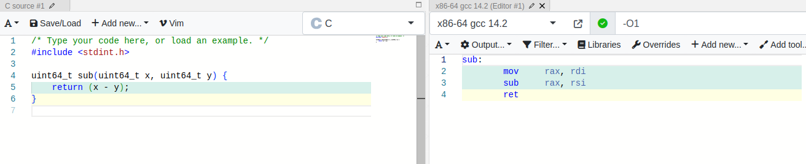

2. `lea` (load effective address) is used to store the address of the `[rdi+rsi]` (sum of the two input variables) into `rax` register.
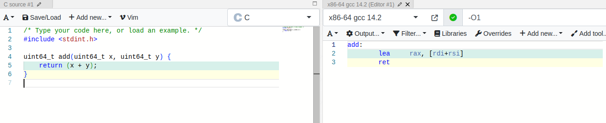
   
3. `add` sums together `rsi` and `rdx` (2nd and 3rd variables), storing the result in `rsi`, and then a call on `lea` is done storing the address of the sum of the new `rsi` and the `rdi` (1st variable).
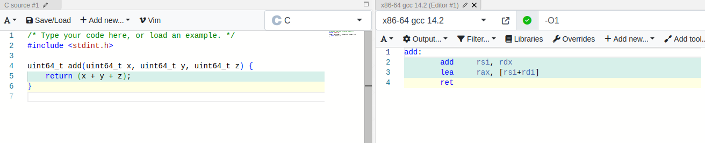

4. `rdx` stores sum and `rax` stores i. 
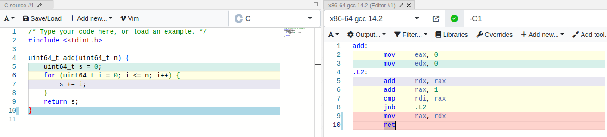

5. 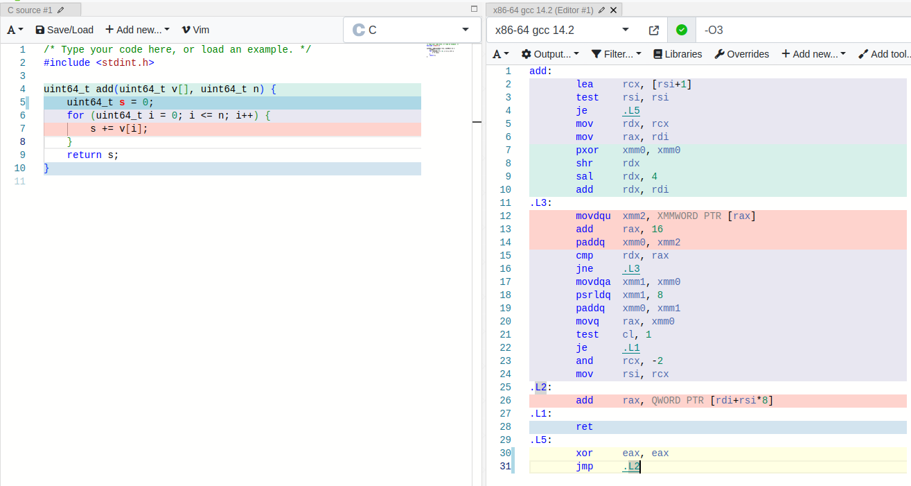

6. The first value in assembly is always `v2` (the last field of the struct). 
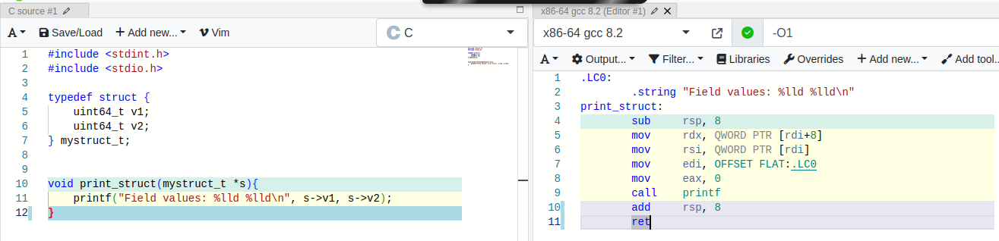

7. 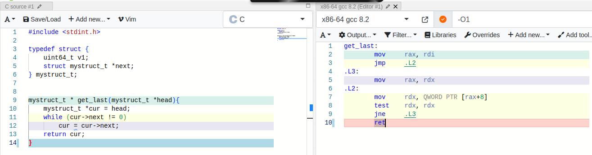

8. Reference: https://www.wyzant.com/resources/answers/686660/why-does-gcc-use-multiplication-by-a-strange-number-in-implementing-integer, https://stackoverflow.com/questions/41183935/why-does-gcc-use-multiplication-by-a-strange-number-in-implementing-integer-divi
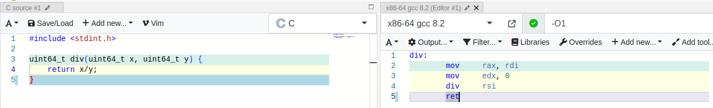

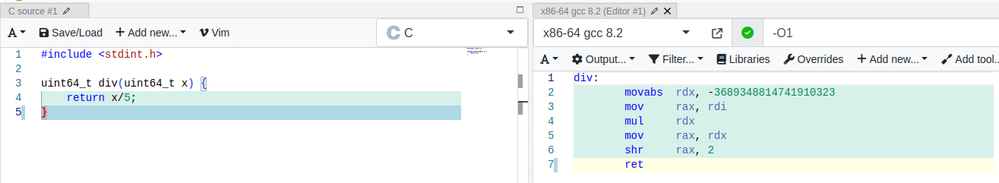

9. 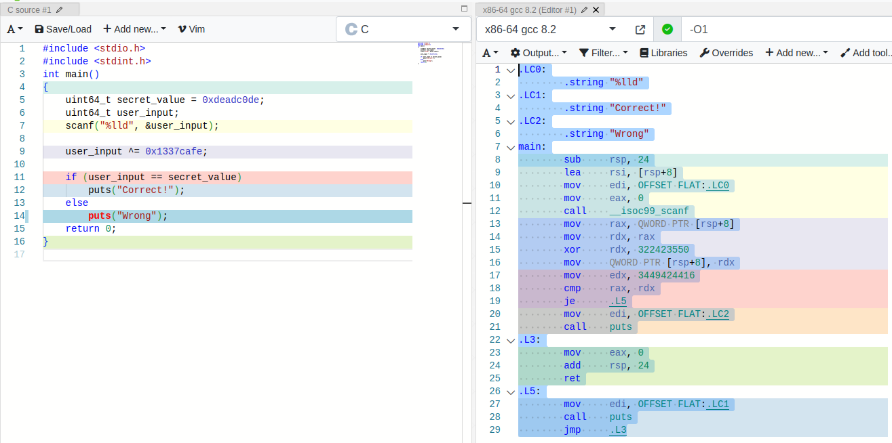

**Tasks**

**T3.1.** The program checks if `rdi` (n) is 0, and if it is, it jumps to `L4` that returns 0. Otherwise, it will initiate `rdx` (i) and `rax` (sum). In the loop, `rdx` is copied into `rcx` and then the square of `rdx` is calculated with `imul`. The result is added to `rax` (sum) and `rdx` is incremented by 1 (i). To determine if the loop is finished, `rdx` (i) is compared to `rdi` (n).
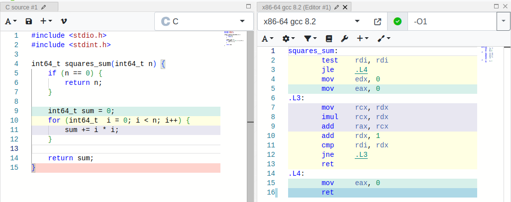

**T3.2.** The function receives 6 parameters. It subtracts `r9` from `r8` (the 5th - the 6th). Then, it adds the `rdx` (the 3rd), it subtracts `rcx` (the 4th) and calculates the address of `r8 + rdi` (the 5th - the 6th + the 3rd - the 4th, until here it's `r8`, + the 1st, which is `rdi`). Lastly, it subtracts `rsi` (which is the 2nd) and it returns the result `rax`.
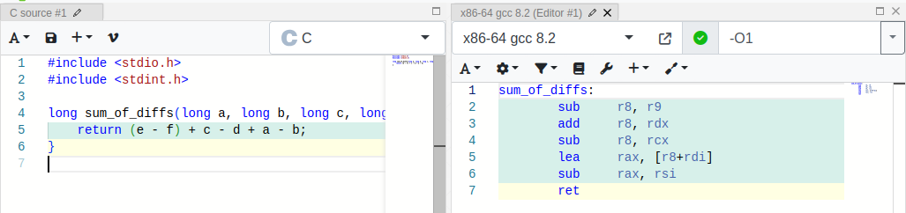

**T3.3** At the beginning, the first character of the string array is checked against 0. If it's 0, it returns. `eax` holds the `i` variable. It will increment by 1 and it will check the first character of the array against '0' string. If it's not '0' string, it remains in the loop.
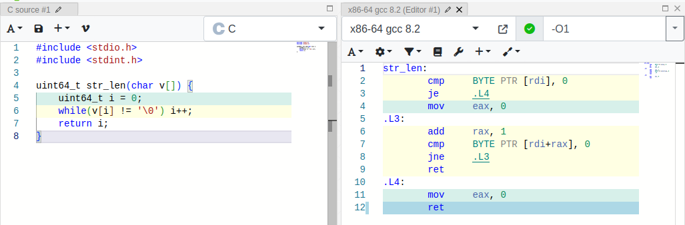

**T3.4** Registers `rbp` and `rbx` are saved and there're 8 octets allocated (supposed it's an `int64`). It also makes a copy of `n` (from `rdi`) in `rbx`. There's a `cmp` instruction for `rdi` against 1 (checking if `n` is greater than 1). If it is, in `.L2`, value from `rbx` is moved into `rax` and then frees the allocated memory in the beginning (the 8 octets, returning `rbx` and `rbp`). After this, in `.L4` it calculates `rdi-1` and stores the address of it in `rdi`. A recursive call is made and the result is saved in `rbp`. It does the same for the second recursive function call and it adds both the results and stores it in `rbx`. Finally, it goes back to `.L2` to free memory.
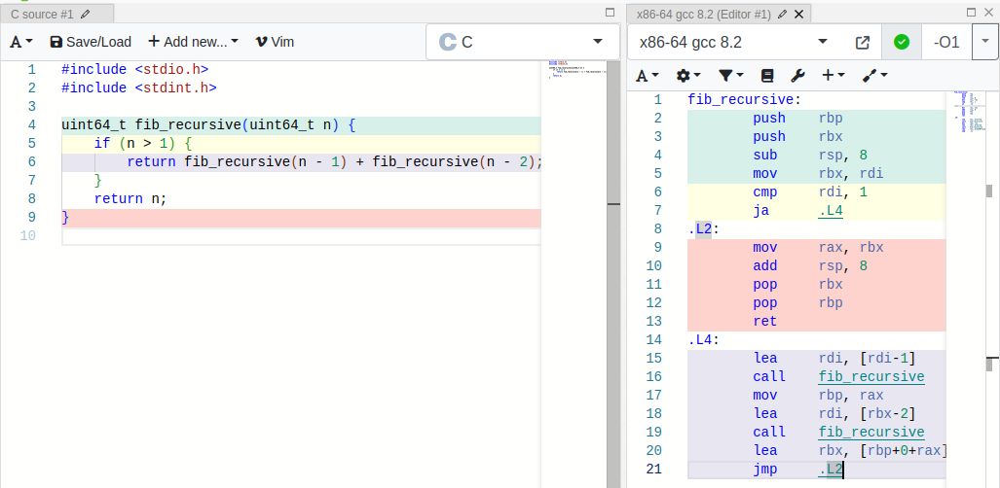
