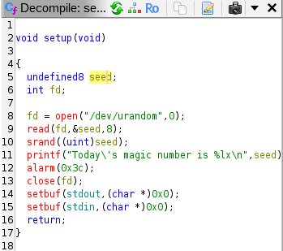

## Laboratory 03

**Tasks**

**T1.** After opening the `riddle.c` file in Ghidra, we found the `main()` function at `FUN_154b()`.

Based on the functions found in `riddle.c`, we start renaming the functions as:
| Function | Pseudocode |
| ----------- | ----------- |
| `setup()` | `FUN_1250()` |
| `gen_rand_string()` | `FUN_12E9()` |
| `chance()` | `FUN_14A6()` |
| `validate()` | `FUN_1441()` |

`validate()` was found in `chance()` while accessing every function before renaming, to check if there are other function calls.

Result after renaming the functions:

We proceed with the next part of renaming the stack variables in `setup()` and `main()`. 
- For `setup()`:
- 
- For `main()`:
- 

And for `chance()` and `gen_rand_string()` we have to rename the stack variables, inluding arrays:
- For `gen_rand_string()`
-  
- For `chance()`:
- 

**T2.** We notice the following strings after running the program:

We import the file into `Ghidra` and we analyze it. After finishing the process, we search for the first string we encountered by `Search - Memory` and we find the reference.

After renaming our functions, we get:

The function that checks the password is:

We double-click on the first element `DAT_004ca174` and then search for the first element of the alphabet at `004ca100`. By using:
- `Data - Terminate Unicode`, and
- `Data - Settings - Mutability - Constant`, 

our function will look like this:

From which we learn what password the program expects. Those hex characters translate to `69F2a+18d346b/SQ5c65e`:

