## Laboratory 04

**Tasks**

**T1.** > Windows Task -- TBA

**T2.** We run the program.

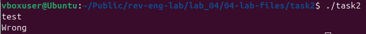

After opening the program with `Ghidra`, we search in `Memory` for `Wrong`, but we have no references:
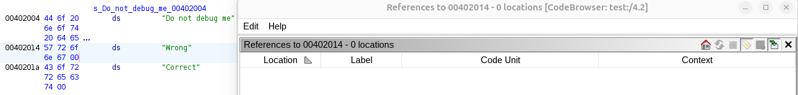

Using `ltrace` shows a different string, `Do not debug me`. 
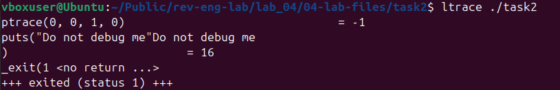

We search for it in `Ghidra`, and we find it in the following function. We keep in mind the address after the `ptrace` call, `0x4011a8`:
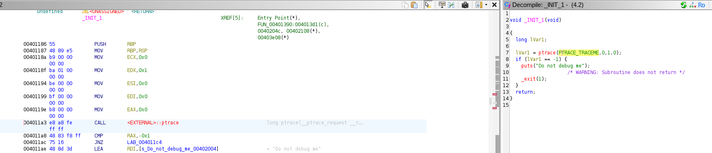

We start `gdb-peda` over the executable and we setup a `breakpoint` at `0x4011a8`.
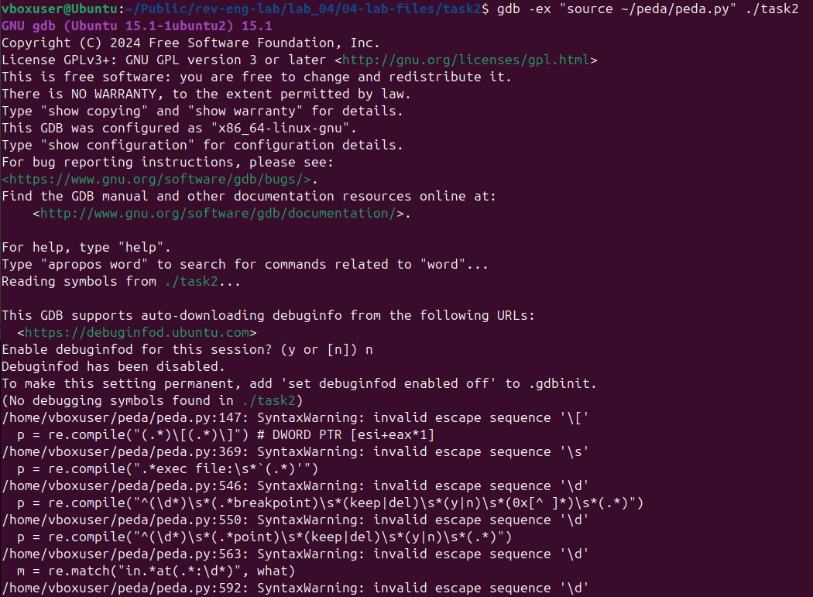
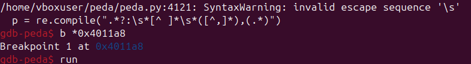

We trigger the program run and we arrive at the `breakpoint` set up earlier. We change the `rax` register, which is used at figuring if the program is debugged or not, to `0`. After using `continue`, we notice that the anti-debugging procedure is bypassed.
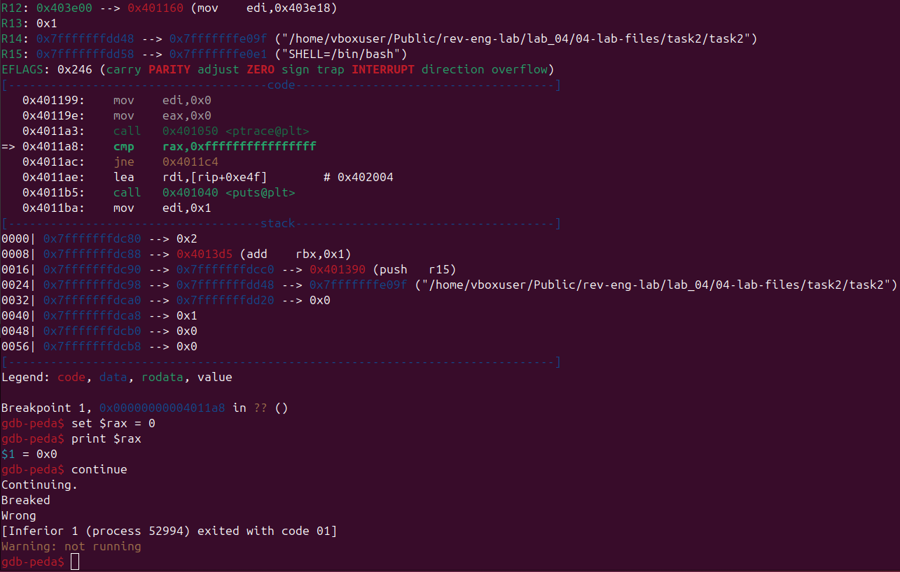

Coming back to `Ghidra`, we find our `main()` function (renamed after):

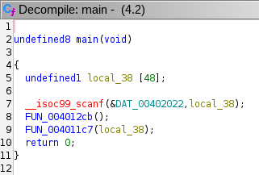 

By accessing the decryption function and reading through the `for-loop` arguments, we can establish the boundary addresses: 
- `0x4011c7` as the starting address, and
- `0x4012cb` as the ending address.
  
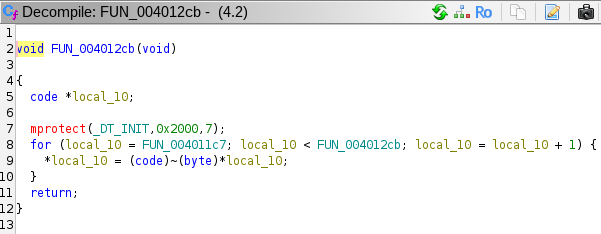

The address we're going to place our second `breakpoint` in `gdb` is:


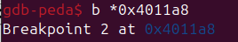

We resume the program until our newly created `breakpoint` and we **dump** the memory into a `dump.txt`. 
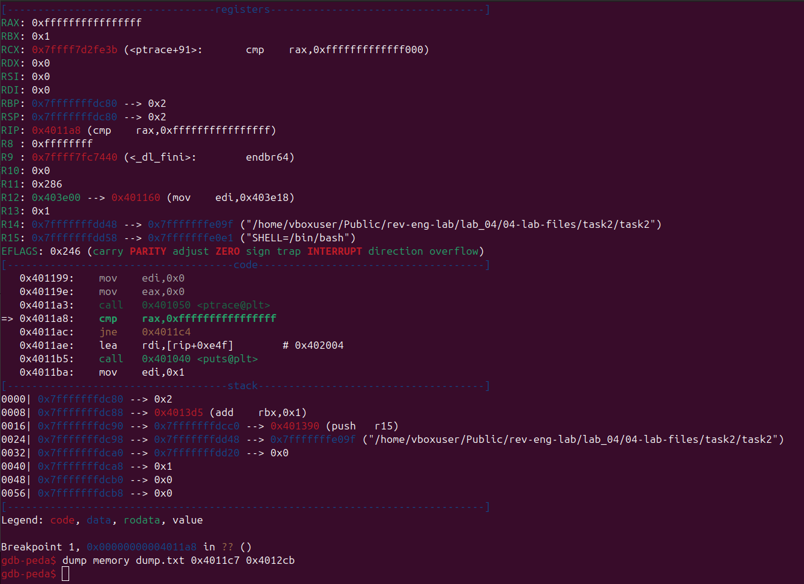

Using `template.py`, the `dump.txt` is converted to a `.elf` file which we open in `Ghidra` from where we learn the bytes that the search is done against:

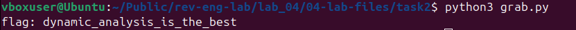
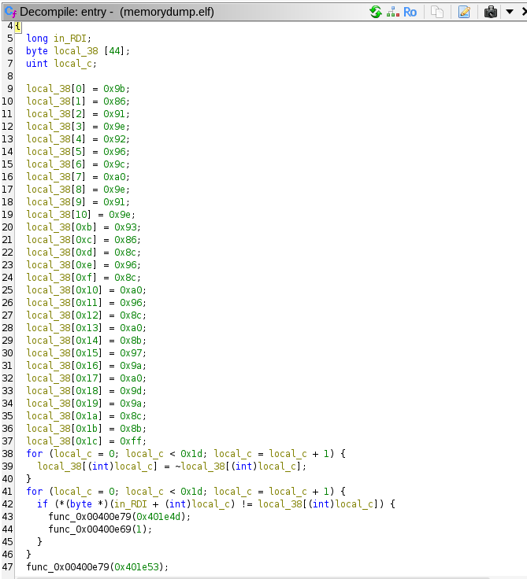

By running `grab.py` (which converts the dumped bytes into readable data), we obtain the following result:
```python
encrypted = [
    0x9b, 0x86, 0x91, 0x9e, 0x92, 0x96, 0x9c, 0xa0, 0x9e, 0x91,
    0x9e, 0x93, 0x86, 0x8c, 0x96, 0x8c, 0xa0, 0x96, 0x8c, 0xa0,
    0x8b, 0x97, 0x9a, 0xa0, 0x9d, 0x9a, 0x8c, 0x8b, 0xff
]

decoded = []
for b in encrypted:
    d = 255 - b
    decoded.append(d)

decoded_str = ''.join(chr(b) for b in decoded if b != 0)
print("flag:", decoded_str)
```
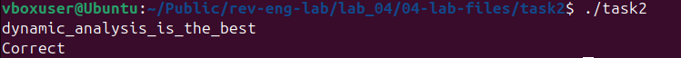


